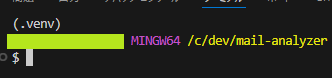

# mail-analyzer

メールの取得・解析バッチ


---

## 📦 概要

IMAP 経由でメールボックスにアクセスし、指定条件に応じて本文抽出・集計を行うツールです。

- マルチスレッド対応
- `.env` による設定切り分け
- エラーログの自動出力

---

## 🔧 セットアップ手順

### 0. 前提

カレントディレクトリは `mail-analyzer`（ルートディレクトリ）にした状態で、各スクリプトを実行する

### 1. リポジトリのクローン

[リンク](https://github.com/9LxCK/mail-analyzer) 先から取得

### 2. 仮想環境の作成、依存関係のインストール

以下スクリプトを実施。**仮想環境をアクティブにする場合、CLI ターミナルの再起動が必要なので注意**

```bash
./scripts/rebuild.sh
```

※仮想環境がアクティブの場合、コンソール左上に仮想環境名（例：.venv）が表示  


### 3. `.env` の設定

ユーザー環境を設定する。  
**「必須キー」「任意キー」のコメントは削除しないこと！**

```env
# --- 必須キー ---
PYTHONPATH=src                              # メインリソースのルートフォルダ
IMAP_HOST='**********'
IMAP_USER='**********'
IMAP_PASS='**********'
# --- 任意キー ---
TARGET_MAILBOXES=INBOX                      # 処理対象メールボックス名
IGNORED_MAILBOXES=Drafts,Sent,Spam,Trash    # 処理対象外メールボックス名
SINCE_DAYS_AGO=1                            # メール情報を何日前の分から取得するか
TO_ADDRESSES=sample@domain.co.jp            # 処理対象宛先名
```

IMAP 接続情報（キー名：IMAP\_\*）は、暗号化して `.env` に登録・確認する。

```bash
# IMAP情報の登録
python -m tool.encrypt_env_key --host <ホスト名> --user <ユーザー名> --pass <パスワード>
# 登録内容確認
python -m tool.encrypt_env_key --show
```

### 4. `config.json` の設定

このアプリケーションは `src/app_config/config.json` を使用して設定を読み込む。  
以下、例を表示（必要に応じて値を修正すること）。

```json
{
  "FETCH_SIZE": 500,
  "MAILS_MAX_COUNT": 10000,
  "OUTPUT_FILE_PATH": "output/mail.txt",
  "MAILBOX_LIST_PATH": "output/mailbox_list.txt",
  "LOG_FILE_PATH": "log/app.log",
  "LOG_LEVEL": "DEBUG",
  "USE_USER_INPUT": false,
  "IS_MULTI_THREADED": true,
  "SPLIT_WORKERS": 4,
  "EXIT_DELAY_SECONDS": 0
}
```

| キー名               | 型     | 説明                                                                                               |
| -------------------- | ------ | -------------------------------------------------------------------------------------------------- |
| `FETCH_SIZE`         | 数値   | 1 回の IMAP フェッチで取得する最大メール件数。値を大きくすると高速化されるが、メモリ消費が増加する |
| `MAILS_MAX_COUNT`    | 数値   | 処理対象とするメールの上限件数。全件処理する場合は大きな値を指定                                   |
| `OUTPUT_FILE_PATH`   | 文字列 | メール本文の出力先ファイルパス                                                                     |
| `MAILBOX_LIST_PATH`  | 文字列 | 処理対象としたメールボックス一覧の出力先パス                                                       |
| `LOG_FILE_PATH`      | 文字列 | ログ出力先ファイルのパス。相対パスまたは絶対パスを指定可能                                         |
| `LOG_LEVEL`          | 文字列 | ログ出力レベルを指定。`DEBUG` / `INFO` / `WARNING` / `ERROR` などに対応                            |
| `USE_USER_INPUT`     | 真偽値 | true の場合、対話的なユーザー入力を許可する。false で自動実行モードになる                          |
| `IS_MULTI_THREADED`  | 真偽値 | true の場合、複数スレッドによる並列処理を有効化                                                    |
| `SPLIT_WORKERS`      | 数値   | 並列処理時に使用するスレッド数。`IS_MULTI_THREADED` が true のときに有効                           |
| `EXIT_DELAY_SECONDS` | 数値   | 処理終了後の待機秒数。ログ確認や監視タイミング調整に使用                                           |
|                      |

## 🏃‍♂️ 実行方法

```bash
# メールボックス名一覧の取得
./run_list_mailboxes.py
# メール本文の取得
./run_fetch_mails.py
# メール本文の取得（件数指定あり）
./run_fetch_mails.py <取得件数>
```

## ⚠️ その他・注意事項

- `.env`、`config.json` でキーの追加・変更があった場合、以下のスクリプトを実行すること

```bash
# ConfigLoaderクラスの再生成
python -m src.tool.generate_config_loader
# EnvConfigクラスの再生成
python -m src.tool.generate_env_config
```

- 補助ツールとして、以下のスクリプトを用意  
  作成した EXE ファイルを実行する場合は、EXE ファイルと同じ階層に `.env` `config.json` を配置すること

| スクリプト名          | 内容                                                             |
| --------------------- | ---------------------------------------------------------------- |
| `scripts/cleanup.sh`  | キャッシュ等、スクリプト実行時に作成される一時ファイルを削除する |
| `scripts/make_exe.sh` | EXE ファイルを作成（※pyinstaller を利用）                        |
|                       |
